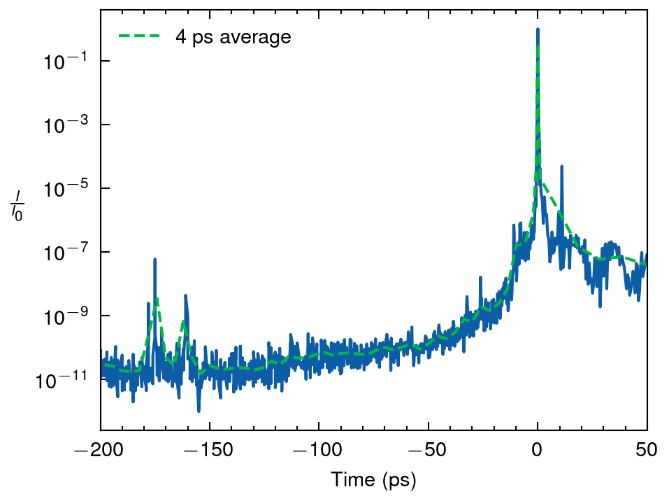

# Contrast
Data for the laser contrast

The measured (solid line) temporal contrast of the 100 TW laser pulse at ELI-NP. The dashed line corresponds to the 4 ps moving average.

This data is provided for the purposes of hydrodynamic simulation.
